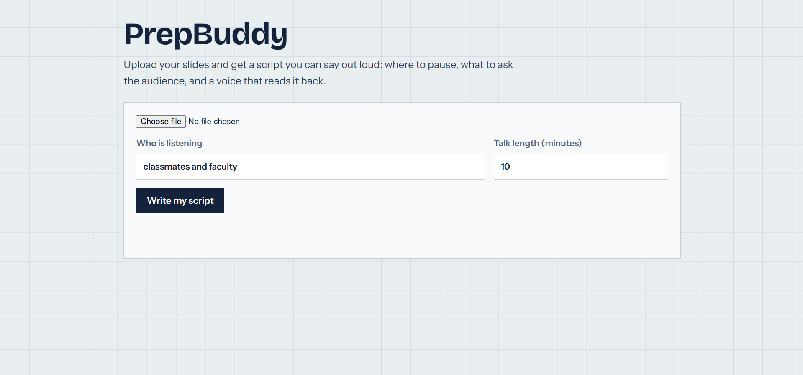
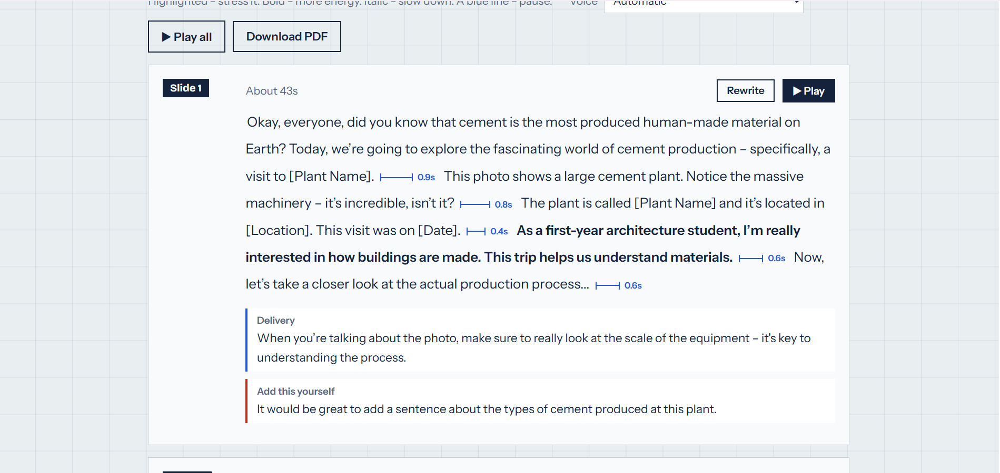
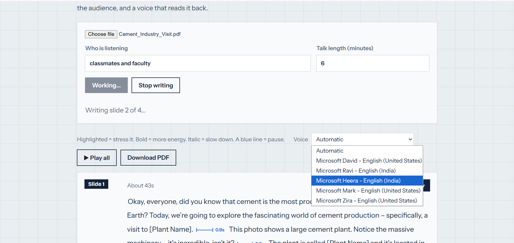

# PrepBuddy

Built for the DEV Hacktoberfest Weekend Challenge: **Build for a Friend**.

PrepBuddy turns a slide deck into a script you can say out loud: what to say, where to pause, what to ask the audience, and a voice that reads it back.

## Who it's for

My sibling, an architecture student. After each industry visit she has to give a group presentation, and she gets nervous. I used to give her tips and a hand-written script with pauses marked, and she kept forgetting the tips. I built this so the tips are in the tool.

## What it does

- Reads a PDF of your slides in the browser.
- Asks a local AI model to write a spoken script for each slide: an opening line (a hook on slide 1, a bridge on the others), short spoken lines, a closing line that leads into the next slide, and a delivery tip.
- Adds an audience question on every second slide (never the last).
- Lists things the model could not know under "Add this yourself", so the presenter fills in the facts.
- Shows pauses as blue dimension lines (like on an architecture drawing). The longer the pause, the longer the line.
- Marks how to say each line: highlighted = stress it, bold = more energy, italic = slow down.
- Reads the script aloud using the browser's built-in voice. The pauses are silence generated by the app, so they are exactly as long as the script says.
- Lets you pick one of the English voices installed on your computer.
- Saves the script as a PDF through the browser's print dialog.

## Screenshots



<details>
<summary>More screenshots</summary>






</details>

## How it works

```
PDF -> pdf.js reads each slide's text (in the browser)
    -> React sends one slide at a time to the Express server
    -> Express builds a prompt and asks Gemma 3 (4B) through Ollama for JSON
    -> the server cleans the answer (clamps pauses, fixes tones, retries once if the JSON is broken)
    -> React shows the script with pause markers
    -> the browser's speech synthesis reads it, with silence between lines
```

## Where the open-source AI is

- **Gemma 3 (4B)**, an open-weight model from Google, writes every script.
- **Ollama** (open source) runs the model on my laptop.
- Without the model there is no script, so it is the core of the project.

Other open-source pieces: React, Vite, Express, pdf.js.

## Run it

You need [Node.js 20+](https://nodejs.org) and [Ollama](https://ollama.com).

1. Download the model: `ollama pull gemma3:4b`
2. Start the server:
```
   cd server
   npm install
```
   Copy `server/.env.example` to `server/.env`, then:
```
   npm run dev
```
3. In a second terminal, start the client:
```
   cd client
   npm install
   npm run dev
```
4. Open http://localhost:5173, choose a PDF and press "Write my script".

Settings in `server/.env`: `PORT`, `OLLAMA_URL`, `MODEL` (the default is `gemma3:4b`).

## What I tested

On one Windows laptop:

- The server detects Ollama and the model.
- A real 4-slide deck went from PDF to finished scripts.
- Windows lists on-device English voices (Microsoft Heera, Ravi, Zira, David, Mark) in Chrome.

## Not verified before the deadline

I ran out of time to check these properly, so please don't take them as promised:

- Running with the network turned off. The app is built to run on the same laptop (the browser talks to a local server, which talks to Ollama), but I have not tested it in airplane mode, and I have not checked what else on the machine uses the network.
- The voice picker, and Download PDF in browsers other than the one I used.
- Anything on macOS or Linux.
- Long decks. An 11-slide deck was slow, so I stopped it after two slides.

## Limits

- Text only. The server can accept a slide image, but the app does not send one yet, so slides that are only drawings get a generic script.
- Slow: a 4B model on a laptop takes roughly 20 to 60 seconds per slide.
- The model can still get facts wrong, so read every script before presenting.
- The browser voice only lets me change speed, pitch and volume, so it sounds robotic and the expression is limited.
- Browsers can offer online voices. The app prefers on-device voices, but if a computer has none, the browser may use an online one.
- Nothing is saved: refresh the page and the scripts are gone.

## What I would build next

Send slide images to Gemma, a more natural local voice, and saving decks.

## Credits

Gemma (Google), Ollama, pdf.js (Mozilla), React, Vite, Express.

I built this with the help of an AI assistant (Claude by Anthropic), which provided guidance and code that I ran, tested and adapted.

## Challenge note

This repository was created for this challenge and started within the challenge window. Any commits made after the submission deadline will be listed here.